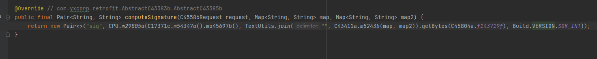
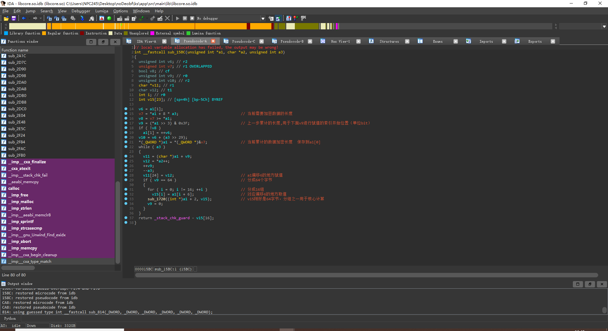
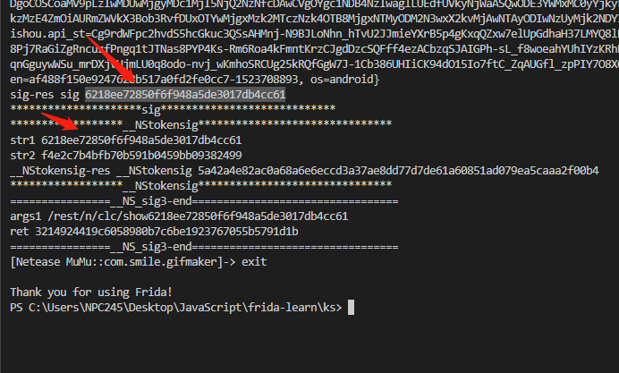

#快手参数分析

## 作者主页视频参数

params原参数:
>/rest/n/feed/profile2?
>mod=Netease%28MuMu%29
>&lon=113.416074
>&country_code=CN
>&kpn=KUAISHOU
>&oc=GDT_YUNMENGFEED%2C13
>&egid=DFP65A53CC03883B7E3B975AE729B173606E9CE346317161D1C6DED34150B56D
>&hotfix_ver=
>&sh=1440
>&appver=6.9.2.11245
>&max_memory=128
>&isp=
>&browseType=1
>&kpf=ANDROID_PHONE
>&did=ANDROID_f6cf9b64a0b3e461
>&net=WIFI
>&app=0
>&ud=1523708893
>&c=GDT_YUNMENGFEED%2C13
>&sys=ANDROID_6.0.1
>&sw=810
>&ftt=
>&language=zh-cn
>&iuid=
>&lat=23.179447
>&did_gt=1649214994337
>&ver=6.9 HTTP/1.1

post原参数：

>user_id=2140016167
>&lang=zh
>&count=30
>&privacy=public
>&referer=ks://profile/2140016167/5237404960907594085/1_a/2000045351932068803_h3110/8
>&__NS_sig3=3212913449c63f4c4299ee2c07f229864c9956dfb7
>&__NStokensig=30264b7550ec06f0d1a4f0abca8ff3656e20a0358c441027f44d9e4aea29ad02
>&kuaishou.api_st=Cg9rdWFpc2hvdS5hcGkuc3QSsAHRXkxcgUgzO0HQeuqImTSXvmvh4eTFpbBj01dNDxHvzyKSe8gBp4pPnptbWITlXtV4EWcrgbZUL025fcmrXLucpTwse16wMLkEKxKuFOsA0_NxA1e7cnvBcXq5fFQ0A-trkc2nq-div-q_96dBsYVm4vfnVP506E9OnfiRFdXraJ7uYOhM58OoR-jgVFTXiLO0-WtrsZzN3zglbQIkdM3Re07spKjwGQEB89SEN517hxoS-tPBa2dkShGl-MeZp6jD2Vq2IiB0r7NbfI02k_WeVjZ7Ej6DASHkc2BDTZKjzWxsmmDaJygFMAE
>&token=22b17b7fd73542ad9ce0a7440f53579e-1523708893
>&client_key=3c2cd3f3
>&os=android
>&sig=48ab0bf6fe3b5f064a054a268585ee22


### sig加密

代码如下
> return new Pair<>("sig", CPU.a(c.a().b(), TextUtils.join("", a.b(map, map2)).getBytes(org.apache.internal.commons.io.a.f), Build.VERSION.SDK_INT));


两个map的key value进行拼接(key=value)组成list， 然后排序， "".join(list)得如下的参数:
参数2：
>app=0appver=6.9.2.11245browseType=1c=GDT_YUNMENGFEED,13client_key=3c2cd3f3country_code=CNdid=ANDROID_d3d9534944ac34c9did_gt=1649228666106egid=DFPA0824D7CD0D92E347A2EA47C9600ECE6B351EC1BD3CF780FEF3B1966CC01Bftt=hotfix_ver=isp=iuid=kpf=ANDROID_PHONEkpn=KUAISHOUkuaishou.api_st=Cg9rdWFpc2hvdS5hcGkuc3QSsAFFJb3fdpPP-uKjTrlf7SL6ItHJCfeUlJdldfqJglJm8EUhwTkDaQtNi_3lS1IUUYb02L5p7XnOv6BDS5ZLLchXGl187wNf-dEoaXKbFwQFnVR-0kOplYyrCf98df2_5JYK-knxj50QlmqLnGbrIOxJOa6kWtxTeeVFv5IZG3XK41NPULg1feDmmLZi2ldSSXeE1buc1g7a__jgJegrNSANVyGphLWAc0m_mbXTeSQG0BoSAbBL62FCSBK90AGy_bo9cyIbIiCKhUsOl4kgm13qf7qgiAbUXFNIDkp4TLhlA9joYDLANCgFMAElanguage=zh-cnlat=23.179447lon=113.416074max_memory=128mod=Netease(MuMu)net=WIFIoc=GDT_YUNMENGFEED,13os=androidpv=truesh=1440sw=810sys=ANDROID_6.0.1token=af488f150e9247628b517a0fd2fe0cc7-1523708893ud=1523708893user=1465882366ver=6.9

参数3：安卓系统版本号

整体算法流程
MD5( 参数二+盐(382700b563f4) ,如下：
>app=0appver=6.9.2.11245browseType=3c=GDT_YUNMENGFEED,13client_key=3c2cd3f3country_code=CNdid=ANDROID_226f00417309d04fdid_gt=1649725884503egid=DFP98FACC71235362821AFBDB7AD630824DA6B6D8D7B316D7FD20795A5E4EF0Bftt=hotfix_ver=isp=iuid=kpf=ANDROID_PHONEkpn=KUAISHOUkuaishou.api_st=Cg9rdWFpc2hvdS5hcGkuc3QSsAE7IV9Cdw8t1w-DuGOKuQ8RUdiD9LiwteObJVcUXCRwdWc30yiRuacNul8_ek0BBu5QMGAcJ3J2Y6ecKovlcx2lyaIVG8QrMxTtYvphRIfb-QOTBVExW-rZ5rf9eDB10o8UYJwhyuNH12IVmdbGGjZWk_KPWK2_7I2OwSyhlFrGQlvgkzJ0HaEisgWmHTXrgPfF1qbDeMGtb93fIZzTox71TrEcxzUAiZDJf1Em84nlfRoSRCUg25kRQfGgW7J-1Cb386UHIiAMrvTJMGawGr2UmVuHYN2zBojPoadTRX9wyoS73Et5_CgFMAElanguage=zh-cnlat=30.626455lon=104.008499max_memory=192mod=huawei(huaweip50)net=WIFIoc=GDT_YUNMENGFEED,13os=androidpv=truesh=1920sw=1080sys=ANDROID_7.1.2token=9b2e6f9c77904fc093f5f841c0100953-1523708893ud=1523708893user=581269109ver=6.9382700b563f4


返回值
> sig d6c1f48d80b40e41fa1551ef794a1171


objection hook 如下:


在so层中核心算法注释




### __NStokensig
代码如图:


参数一:sig

参数二:
client_salt


### __NS_sig3

主要逻辑：

```
  String str2 = (String) this.f23202a.getRouter().mo77266a(10405, new String[]{new String(iVar.m77517i()).trim()}, KSecurity.getkSecurityParameterContext().getAppkey(), -1, Boolean.FALSE, KSecurity.getkSecurityParameterContext().getContext(), 0, Boolean.valueOf(iVar.m77529b()));
                   
```

代码中如图所示:

其中的变量 i 是 okhttp中的函数：
https://github.com/1184893257/okhttp/blob/master/okhttp/src/main/java/com/squareup/okhttp/HttpUrl.java
```
   /** 
   * 返回此URL的完整路径，编码后用于HTTP资源解析。的
   * 返回的路径总是非空的，并且以{@code /}为前缀。  
   * Returns the entire path of this URL, encoded for use in HTTP resource resolution. The
   * returned path is always nonempty and is prefixed with {@code /}.
   */
  public String encodedPath() {
    int pathStart = url.indexOf('/', scheme.length() + 3); // "://".length() == 3.
    int pathEnd = delimiterOffset(url, pathStart, url.length(), "?#");
    return url.substring(pathStart, pathEnd);
  }
```

objection hook 如下:


参数：
url_path+sig，如下
/rest/n/user/profile/v2 + e622b9ee77fc040a78948ddb7595f767
返回值：
42位的全小写字符

### client_key


### kuaishou.api_st


### token


## 博主主页信息参数
待分析